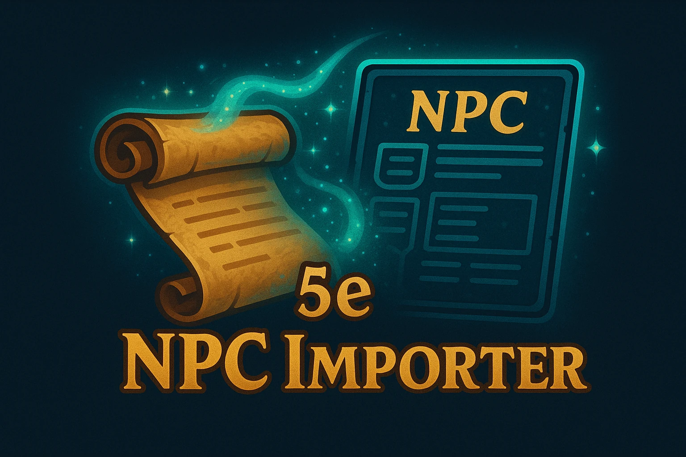

**Import D&D 5th Edition NPC statblocks from a custom JSON format directly into the official 'D&D 5e by Roll20' character sheet.**

This script aims to simplify and automate the process of creating NPC entries in Roll20, saving you time and ensuring consistency. It's designed to handle a comprehensive range of NPC data, from basic stats to complex actions and spellcasting abilities.

## Table of Contents

- [Quick Start](#quick-start)
- [Purpose](#purpose)
- [Why Use This Script?](#why-use-this-script)
- [Key Features](#key-features)
- [Installation](#installation)
  - [Simple Installation (Recommended)](#simple-installation-recommended)
  - [For Developers (Building from Source)](#for-developers-building-from-source)
- [Usage](#usage)
  - [Primary Import Method: Handout](#primary-import-method-handout)
  - [Alternative: Inline JSON (for shorter inputs)](#alternative-inline-json-for-shorter-inputs)
  - [Importing from Token GM Notes](#importing-from-token-gm-notes)
- [JSON Format](#json-format)
  - [Definitive Guide: `JSON_STRUCTURE.md`](#definitive-guide-json_structuremd)
  - [Example Files](#example-files)
  - [Quick Overview of Core Fields](#quick-overview-of-core-fields)
- [Advanced Notes & Utilities](#advanced-notes--utilities)
- [Troubleshooting & Known Issues](#troubleshooting--known-issues)
- [Acknowledgements](#acknowledgements)
- [Contributing (Future)](#contributing-future)
- [License](#license)
- [Compatibility](#compatibility)

## Quick Start (3 Easy Steps)

1.  **Install:** Copy `5e_NPC_JSON_Importer.js` from the `scripts/` directory into your Roll20 game's API Scripts page.
2.  **Create JSON:** Prepare your NPC data in the correct JSON format (see [JSON_STRUCTURE.md](JSON_STRUCTURE.md)) and paste it into the GM Notes section of a Roll20 Handout.
3.  **Import:** In the Roll20 chat, type `!5enpcimport handout|YourHandoutName` (replace `YourHandoutName` with the exact name of your handout).

✨ **That's it! Your NPC is ready to use.** ✨

## Purpose

Manually entering complex NPC statblocks into Roll20 can be time-consuming and error-prone. This script automates that process by allowing you to define an NPC in a structured JSON format and import it with a single command. It's particularly useful for:

*   Game Masters preparing multiple custom NPCs.
*   Content creators looking to share NPCs in a portable format.
*   Anyone wanting to quickly populate their Roll20 game with monsters from various sources (assuming you convert them to the script's JSON format).
*   Game Masters leveraging AI (like LLMs) for rapid NPC generation, with future potential for streamlined workflows via MCP server integration.

## Why Use This Script?

*   **Import NPCs in Seconds:** Drastically reduces time spent on manual data entry.
*   **Perfect for AI-Generated NPCs:** Quickly bring NPCs from ChatGPT, Claude, Gemini, or other LLMs into your game by formatting their output into the script's JSON structure.
*   **Automated Token Setup:** Automatically links tokens, sets HP/AC bars, and assigns default tokens.
*   **Consistency & Accuracy:** Ensures NPCs are created uniformly and reduces transcription errors.
*   **Portability:** Use human-readable JSON to easily create, share, and backup your NPCs outside Roll20.

## Key Features

*   **Comprehensive Attribute Handling:** Sets core stats (Strength, Dexterity, etc.), skills, saving throws, Armor Class (including notes and type), Hit Points, speed, senses (including passive perception), languages, Challenge Rating, and XP.
*   **Improved Inline JSON Import:** Robustly handles JSON pasted directly into the chat via `!5enpcimport {...}` or `!5enpcimport '{...}`.
*   **Repeating Sections:**
    *   **NPC Actions:** Parses and creates standard NPC actions, including attack rolls and damage.
    *   **Legendary Actions:** Creates legendary actions with their descriptions and count.
    *   **Reactions:** Creates reactions with their descriptions.
    *   **Traits:** Adds special traits and abilities.
    *   **Bonus Actions:** Creates bonus actions with their descriptions.
*   **Spellcasting:**
    *   Sets the spellcasting ability (e.g., Intelligence, Wisdom, Charisma).
    *   Defines spell slots per level using a `spell_slots` object (e.g., `"spell_slots": { "1": 4, "2": 3 }`).
    *   Sets the caster level.
    *   **Important:** The script currently **does not** populate individual spells into the character sheet's spellbook. Spells known/prepared should be listed in the description of a "Spellcasting" trait (see `examples/lich.json`). Users will need to manually add spells to the sheet after import.
    *   *Note: Automatic calculation of spell attack bonus and save DC may require a manual sheet worker nudge (see [Troubleshooting](#troubleshooting--known-issues)).*
*   **Mythic Actions:** Supports the "Mythic Actions" checkbox, the associated description field, and creates individual mythic actions with their names, descriptions, and optional costs.
*   **Biography & Information:** Populates the "Bio & Info" tab on the character sheet (via the `bio` field in JSON).
*   **CR Benchmarks:** Whispers the DMG's benchmark statistics (Proficiency Bonus, AC, HP, Attack Bonus, Damage/Round, Save DC) for the imported NPC's Challenge Rating to the GM for quick reference.
*   **Initiative Tiebreaker:** Supports setting the initiative tiebreaker (e.g., using Dexterity via `"init_tiebreaker": "@{dexterity}/100"`).
*   **Token Integration:** 
    *   **GM Notes Import:** Imports NPC JSON directly from a selected token's GM Notes.
    *   **Token Linking:** Links the selected token to the newly created/updated character sheet (`represents` field and token `name`).
    *   **Bar Updates:** Updates the token's Bar 1 (HP) and Bar 2 (AC) based on the imported JSON data.
    *   **Default Token Assignment:** Sets the configured token as the default token for the character sheet, making it appear in the journal and when dragged to the VTT.

## Compatibility

**Important:** This script is specifically designed for and tested with the **"D&D 5e by Roll20"** character sheet (the classic/legacy 5e sheet). 

**2024 Character Sheet:** At this time, compatibility with the newer "D&D 5e (2024)" character sheet has not been tested or verified. The script may not function correctly with the 2024 sheet due to potential differences in attribute names, sheet workers, and data structure. 

If you're using the 2024 character sheet and encounter issues, please consider switching to the classic "D&D 5e by Roll20" sheet for your NPCs, or check back for future updates that may add 2024 sheet support.

To verify which character sheet you're using: Go to Game Settings → Character Sheet Template and look for "D&D 5e 2014 by Roll20" (classic) vs "D&D 5e 2024 by Roll20" (newer).

## Installation

### Simple Installation (Recommended)

For most users, this is the only method you need:

1.  **Download the Script:** Go to the `scripts/` directory in this repository and download the latest `5e_NPC_JSON_Importer.js` file.
2.  **Open Your Roll20 Game:** Navigate to the game where you want to install the script.
3.  **Go to API Scripts:** On the Game Details page, click on "API Scripts" under the "Addons" section.
4.  **New Script:** Click the "New Script" tab.
5.  **Paste the Code:**
    *   Delete any placeholder content like `"use strict";` from the editor.
    *   Open the `5e_NPC_JSON_Importer.js` file you downloaded in a text editor (like Notepad, VS Code, Sublime Text, etc.).
    *   Copy the *entire contents* of the file.
    *   Paste the copied code into the Roll20 API script editor.
6.  **Name the Script (Optional but Recommended):** You can give it a name like "5e_NPC_JSON_Importer" in the field above the code editor.
7.  **Save Script:** Click the "Save Script" button. The API sandbox will restart.

The script should now be active in your game. You'll see a confirmation message in the API console (accessible from the script editor page) and a whisper to the GM in chat if it loads correctly (e.g., `-=> ImportNpcJson v1.0.2 <=- ready. Core loaded. Utils should be loaded.` or in chat: `ImportNpcJson v1.0.2 loaded and ready.`).

**Important:** You do **not** need to install any other files from this repository (like those in `scripts/util/` or `scripts/npc_importer_modules/`) for the importer to work. The `5e_NPC_JSON_Importer.js` file is self-contained.

### For Developers (Building from Source)

If you want to modify the script's modules or contribute to its development:

1.  **Clone the Repository:** `git clone <repository_url>`
2.  **Navigate to `scripts/`:** `cd roll20-5e-npc-json-importer/scripts/`
3.  **Run the Build Script:** Execute `./build_roll20_bundle.sh`. This will concatenate all the necessary JavaScript modules from the `scripts/npc_importer_modules/` directory into the main `5e_NPC_JSON_Importer.js` file in the `scripts/` directory.
4.  You can then install the freshly built `5e_NPC_JSON_Importer.js` as described in the "Simple Installation" section.

## Usage

### Primary Import Method: Handout

This is the recommended way to import NPCs, especially for more complex statblocks, as it avoids chat message length limitations.

1.  **Create a Handout:** In your Roll20 game, create a new Handout (Journal tab -> Add -> Handout).
2.  **Name the Handout:** Give the handout a descriptive name (e.g., "Goblin Boss Stats", "My Custom Dragon").
3.  **Paste JSON Data:** Copy your complete NPC JSON data.
    *   Paste it into either the **GM Notes** section (preferred, as it keeps it hidden from players) or the **Description & Notes** section of the handout.
    *   The script will read from GM Notes first. If GM Notes is empty, it will then try to read from the main Description & Notes section.
4.  **Save the Handout.**
5.  **Use the Chat Command:** In the Roll20 chat, type:
    `!5enpcimport handout|<HANDOUT_NAME>`
    Replace `<HANDOUT_NAME>` with the exact name of the handout you created (case-sensitive).

    **Example:**
    If your handout is named "Goblin Boss Stats", the command would be:
    `!5enpcimport handout|Goblin Boss Stats`

Upon successful import, a new character sheet will be created for the NPC, and a confirmation message (including CR benchmarks) will be whispered to the GM.

### Alternative: Inline JSON (for shorter inputs)

For very simple NPCs or quick tests, you can provide the JSON data directly in the chat command. The script supports bare JSON or JSON wrapped in single quotes (which is helpful if your JSON contains double quotes).

**Syntax:**

*   `!5enpcimport {JSON_DATA}`
*   `!5enpcimport '{JSON_DATA}'`

Where `<JSON_DATA>` is the complete JSON object for the NPC.

**Examples:**

Bare JSON:
`!5enpcimport {"name":"Goblin","cr":"1/4","ac":15,"hp":7}`

Single-quoted JSON (useful if your JSON string contains double quotes internally):
`!5enpcimport '{"name":"Goblin Chief","type":"humanoid (goblinoid)","ac":{"value":17,"notes":"chain mail, shield"},"hp":22}'`

**Notes:**
*   The JSON data must be valid.
*   This method is best for JSON strings that fit comfortably within Roll20's chat message length limits.
*   Avoid using `%{...}` to wrap raw JSON for this command; that syntax is intended for Roll20 Ability macros, not direct inline JSON input for this script.

### Importing from Token GM Notes

You can also import an NPC by pasting its JSON data directly into the GM Notes field of a token.

1.  **Prepare the Token:**
    *   Place a token on the VTT.
    *   Open the token's settings (double-click or right-click and choose "Edit").
    *   Go to the **GM Notes** tab.
    *   Paste the complete NPC JSON data into the GM Notes field.
    *   Save the token settings.
2.  **Select the Token:** Click on the token to select it.
3.  **Use the Chat Command:** In the Roll20 chat, type:
    `!5enpcimport`
    (Ensure no other arguments like `handout|...` or inline JSON follow the command).

Upon successful import, a new character sheet will be created for the NPC. The selected token will then be automatically configured:
*   It will be linked to represent the newly imported character (its `represents` field is set).
*   Its name will be updated to match the NPC's name from the JSON.
*   Its Bar 1 will be set to the NPC's HP (current and max), and Bar 2 to the NPC's AC.
*   This configured token will also be set as the **default token** for the character sheet. This means the character's journal entry will display this token's image, and dragging the character from the journal to the VTT will create a copy of this pre-configured token.

### Getting Help

To see a list of available commands and examples directly in Roll20 chat, use the help command:

`!5enpcimport help`

This will whisper a help message to you, including a brief overview of command syntax and a link to the full documentation.

## JSON Format

The script expects a specific JSON structure to correctly map data to the D&D 5e character sheet.

### Definitive Guide: `JSON_STRUCTURE.md`

**For a complete and detailed specification of all supported JSON fields, their data types, whether they are required or optional, and examples, please refer to the [JSON_STRUCTURE.md](JSON_STRUCTURE.md) file in this repository.**

This guide is the single source of truth for the JSON format.

### Example Files

Working example JSON files demonstrating the structure can be found in the `test_npcs/` directory of this repository (e.g., `comprehensive_monster_example.json`, `simple_guard_example.json`, `spellcaster_npc_test.json`). Reviewing these files, in conjunction with `JSON_STRUCTURE.md`, is highly recommended.

### Quick Overview of Core Fields

While `JSON_STRUCTURE.md` contains the full details, here are a few of the most fundamental top-level fields to give you a basic idea:

*   `name`: (String, Required) NPC's name.
*   `abilities`: (Object, Required) Contains `str`, `dex`, `con`, `int`, `wis`, `cha` scores.
*   `hp`: (Number or Object, Required for combatants) Hit points (e.g., `{"average": 50, "formula": "8d8+16"}`).
*   `ac`: (Number or Object, Required for combatants) Armor class (e.g., `{"value": 16, "notes": "natural armor"}`).
*   **Spellcasting Data:** The script populates `spellcasting_ability`, `caster_level`, and `spell_slots`. The list of spells known/prepared should be included in the description of a "Spellcasting" trait (see the `lich.json` example). **Currently, the script does not populate the individual spells into the character sheet's spellbook.** This is to avoid excessively large JSON files and added complexity. Users will need to manually drag and drop spells onto the character sheet after import. Future research will explore options for automated spellbook population.
*   **Status:** This is a known issue, likely related to the timing of sheet worker execution. The `todo.md` has an item to re-evaluate if a manual "nudge" (e.g., re-setting `spellcasting_ability` with `setWithWorker: true` in the script) is still needed after recent changes.

## Troubleshooting & Known Issues

*   **Performance:** Please be aware that the script can take anywhere from 5 to 25 seconds to fully import an NPC and create/update the character sheet. This is dependent on the complexity of the NPC and current Roll20 API server load. Efforts to improve performance are ongoing.
*   **Spell Attack Bonus & Save DC:** Currently, the script sets the spellcasting ability, caster_level, proficiency bonus, and spell slots. However, the dependent `spell_attack_bonus` and `spell_save_dc` attributes may not always auto-calculate immediately upon import.
    *   **Status:** This is a known issue, likely related to the timing of sheet worker execution. The `todo.md` has an item to re-evaluate if a manual "nudge" (e.g., re-setting `spellcasting_ability` with `setWithWorker: true` in the script) is still needed after recent changes.
    *   **Workaround:** Manually toggling the spellcasting ability in the character sheet UI (e.g., select "None", then re-select the correct ability) usually forces the sheet to recalculate these values.
*   **Understanding the Success Message:** After a successful import, you'll see a message like: `✅ Successfully imported [NPC Name] (ID: [Character ID]) in [time]ms. Check attacks/options. Add Lair/Spells manually. (vX.X.X)`
    *   `Check attacks/options`: While the script aims for accuracy, it's good practice to quickly review complex NPC actions, bonus actions, reactions, and legendary actions on the character sheet. Ensure that any special riders, conditions, or multi-part effects described in the text have been captured or are noted for manual adjudication. Sometimes, the nuanced text of an ability might need slight manual adjustment on the sheet if it involves choices or complex triggers not fully representable by simple repeating section fields.
    *   `Add Lair/Spells manually`: 
        *   **Lair Actions:** If your NPC has Lair Actions distinct from its Mythic Actions, you will need to manually add these to the "Lair Actions" section of the NPC's statblock on the character sheet. The JSON field `mythic_actions` can be used to *display* text related to lair actions if you wish, but it doesn't mechanically populate a separate Lair Actions sheet section.
        *   **Spells:** As noted in "Key Features", the script sets up the spellcasting infrastructure (ability, slots, caster level) but does **not** add individual spells to the spellbook. You must manually drag and drop spells from the Roll20 Compendium (or manually create them) onto the imported NPC's character sheet.

## Acknowledgements

*   A big thank you to **Zanthox** ([@Zanthox](https://github.com/Zanthox)) for the original [Roll205eSheetImport](https://github.com/Zanthox/Roll205eSheetImport) script (also discussed on the [Roll20 Forums](https://app.roll20.net/forum/post/10800206/script-importstats-take-monster-stat-blocks-and-import-them-into-roll20-5e-npc-sheets)), which served as a foundational inspiration and a valuable learning resource for this project. Many of the initial concepts and approaches for parsing complex statblocks were derived from their pioneering work.
*   Additionally, special thanks to **timmaugh** (Roll20 Forum Champion, API Scripter) for their invaluable suggestions on improving script scoping (using IIFE/Revealing Module Pattern) and standardizing `on('ready')` event handling. These contributions significantly enhanced the script's robustness and adherence to Roll20 API development best practices (as of v1.0.2).

## License

This script is licensed under the [MIT License](LICENSE).